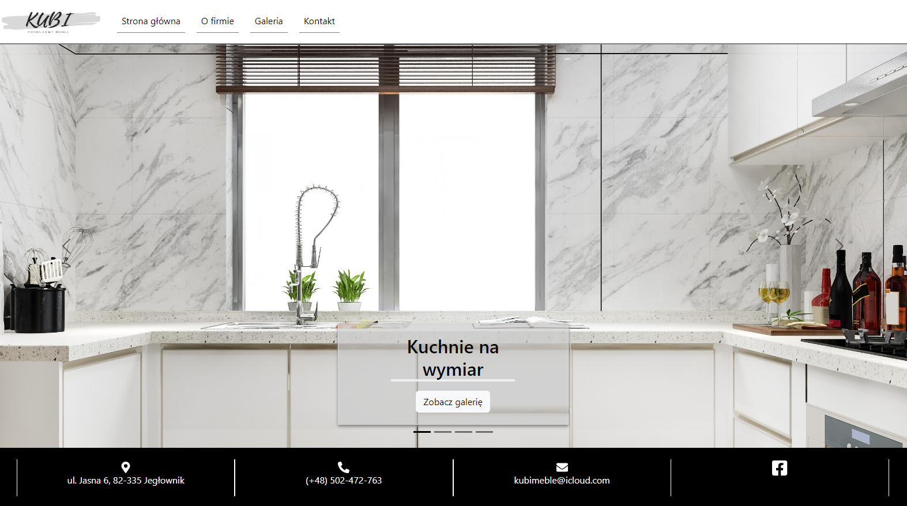

# kubi-producent-mebli

## Overview

This project involves the development of an authentic company website in collaboration with stakeholders. The website is built using React and features the integration of Leaflet maps to create an immersive and engaging user interface. To streamline communication, the implementation includes the seamless integration of form submissions using Email.js. This functionality ensures that form entries are efficiently directed to the designated email address, enhancing communication efficiency. A key focus of the project is prioritizing user experience. This is achieved through the implementation of a responsive design approach using React-Bootstrap, guaranteeing optimal usability across a variety of mobile devices.

## Table of Contents

- [Overview](#overview)
- [Demo and Screenshots](#demo-and-screenshots)
- [Technologies Used](#technologies-used)

## Demo and Screenshots

The deployed application: [kubiproducentmebli.pl](https://kubiproducentmebli.pl/)

## Technologies Used

- 
- 
- 
-  
- 
- EmailJS

## License

N/A